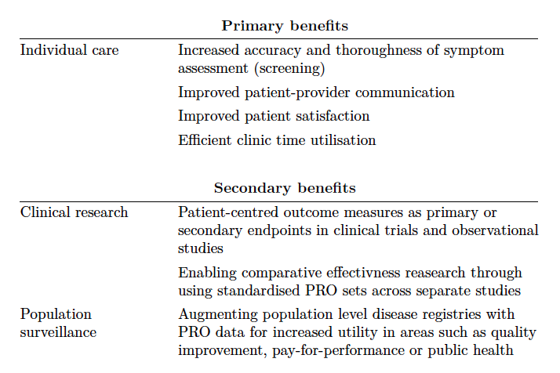

# [PROsaiq](http://tschuler.github.io/prosaiq) Background

## From PRO to ePRO

Patient-reported outcome (PRO) questionnaires measure a patient's perception of the impact of a disease and its treatment[^khadka_importance_2012]. PRO information enhances patient-centred care generally, but is particularly useful in oncology where side-effects from treatment are common[^lipscomb_patient-reported_2007].

Initially PROs were almost exclusively collected in research[^brundage_patterns_2011] using a classic pen and paper approach, however the advent of electronic PRO (ePRO) systems based on tablet or web technologies has allowed their use in routine oncological practice[^basch_supporting_2011], in palliative care[^antunes_implementing_2013] and during cancer survivorship[^ashley_feasibility_2011].

## Motivation

There is good evidence that ePRO collection improves the care of the individual patient[^bennett_electronic_2012],[^chen_systematic_2013] and provides new opportunities for clinical research and population surveillance [^snyder_patient-reported_2013],[^wu_measure_2013]. The table below summarises these benefits. 

The PROsaiq project aims to enable the benefits of ePRO in day-to-day clincal practice using the MOSAIQ® oncology information system. Concerns with ePRO systems identified by reseaerch[^jagsi_qualitative_2013] have been addressed in the PROsaiq design, which is described in an open access JROI article (see [coming soon...](http://jroi.org)).

[^khadka_importance_2012]: Khadka, J., Gothwal, V.K., McAlinden, C., Lamoureux, E.L., Pesudovs, K., 2012. The importance of rating scales in measuring patient-reported outcomes. Health Qual Life Outcomes 10, 80. doi:10.1186/1477-7525-10-80 [\[Full text\]](http://www.hqlo.com/content/10/1/80)

[^lipscomb_patient-reported_2007]: Lipscomb, J., Gotay, C.C., Snyder, C.F., 2007. Patient-reported outcomes in cancer: a review of recent research and policy initiatives. CA Cancer J Clin 57, 278–300. doi:10.3322/CA.57.5.278 [\[Full text\]](http://onlinelibrary.wiley.com/enhanced/doi/10.3322/CA.57.5.278)

[^brundage_patterns_2011]: Brundage, M., Bass, B., Davidson, J., Queenan, J., Bezjak, A., Ringash, J., Wilkinson, A., Feldman-Stewart, D., 2011. Patterns of reporting health-related quality of life outcomes in randomized clinical trials: implications for clinicians and quality of life researchers. Qual Life Res 20, 653–664. doi:10.1007/s11136-010-9793-3 [\[PubMed abstract\]](http://www.ncbi.nlm.nih.gov/pubmed/21110123)

[^basch_supporting_2011]: Basch, E., Abernethy, A.P., 2011. Supporting clinical practice decisions with real-time patient-reported outcomes. J. Clin. Oncol. 29, 954–956. doi:10.1200/JCO.2010.33.2668 [\[Full text\]](http://jco.ascopubs.org/content/29/8/954.long)

[^antunes_implementing_2013]: Antunes, B., Harding, R., Higginson, I.J., on behalf of EUROIMPACT, 2013. Implementing patient-reported outcome measures in palliative care clinical practice: A systematic review of facilitators and barriers. Palliat Med. doi:10.1177/0269216313491619 [\[Full text\]](http://pmj.sagepub.com/content/28/2/158.long)

[^ashley_feasibility_2011]: Ashley, L., Jones, H., Forman, D., Newsham, A., Brown, J., Downing, A., Velikova, G., Wright, P., 2011. Feasibility test of a UK-scalable electronic system for regular collection of patient-reported outcome measures and linkage with clinical cancer registry data: The electronic Patient-reported Outcomes from Cancer Survivors (ePOCS) system. BMC medical informatics and decision making 11, 66. [\[Full text\]](http://www.ncbi.nlm.nih.gov/pmc/articles/PMC3212976/)

[^bennett_electronic_2012]: Bennett, A.V., Jensen, R.E., Basch, E., 2012. Electronic patient-reported outcome systems in oncology clinical practice. CA Cancer J Clin 62, 337–347. doi:10.3322/caac.21150 [\[Full text\]](http://onlinelibrary.wiley.com/doi/10.3322/caac.21150/full)

[^chen_systematic_2013]: Chen, J., Ou, L., Hollis, S.J., 2013. A systematic review of the impact of routine collection of patient reported outcome measures on patients, providers and health organisations in an oncologic setting. BMC Health Serv Res 13, 211. doi:10.1186/1472-6963-13-211 [\[Full text\]](http://www.biomedcentral.com/1472-6963/13/211)

[^jagsi_qualitative_2013]: Jagsi, R., Chiang, A., Polite, B.N., Medeiros, B.C., McNiff, K., Abernethy, A.P., Zon, R., Loehrer, P.J., 2013. Qualitative Analysis of Practicing Oncologists’ Attitudes and Experiences Regarding Collection of Patient-Reported Outcomes. JOP 9, e290–e297. doi:10.1200/JOP.2012.000823 [\[Full text\]](http://jop.ascopubs.org/content/9/6/e290.long)

[^snyder_patient-reported_2013]: Snyder, C.F., Aaronson, N.K., Choucair, A.K., Elliott, T.E., Greenhalgh, J., Halyard, M.Y., Hess, R., Miller, D.M., Reeve, B.B., Santana, M., 2012. Implementing patient-reported outcomes assessment in clinical practice: a review of the options and considerations. Qual Life Res 21, 1305–1314. doi:10.1007/s11136-011-0054-x [\[PubMed abstract\]](http://www.ncbi.nlm.nih.gov/pubmed/22048932)

[^wu_measure_2013]: Wu, A.W., Kharrazi, H., Boulware, L.E., Snyder, C.F., 2013. Measure once, cut twice--adding patient-reported outcome measures to the electronic health record for comparative effectiveness research. J Clin Epidemiol 66, S12–20. doi:10.1016/j.jclinepi.2013.04.005 [\[Full text\]](http://www.jclinepi.com/article/S0895-4356%2813%2900154-6/fulltext)
